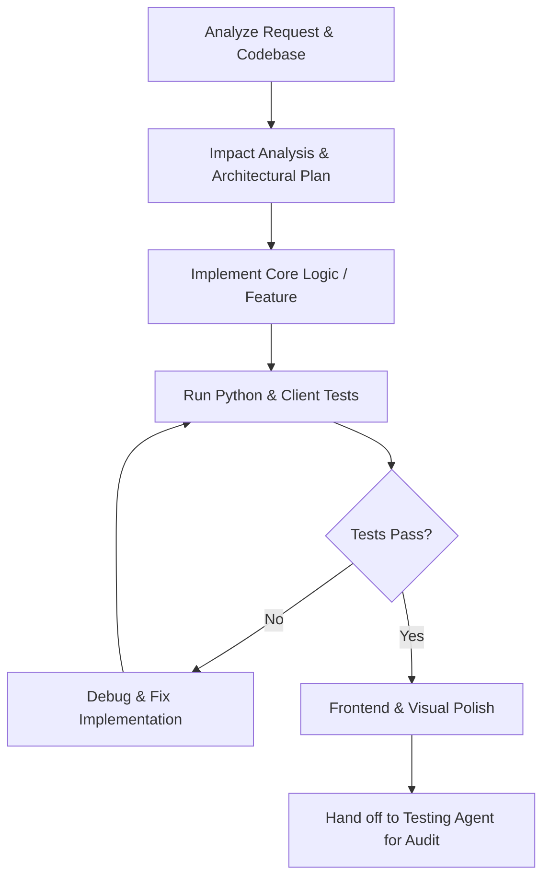

# Cricket Game — Development Agent Operating Rules

> **Project:** Even/Odd Strategic Cricket Game (Google Doodle Inspired)  
> **Backend:** Python Engine (`cricket_backend/`)  
> **Frontend:** HTML5 / CSS3 / JavaScript (`index.html`, `js/`, `css/`)  
> **Reference:** [`DOCUMENTATION_AGENT.md`](file:///c:/Users/Ashay/Desktop/CricketGame/DOCUMENTATION_AGENT.md) | [`TESTING_AGENT.md`](file:///c:/Users/Ashay/Desktop/CricketGame/TESTING_AGENT.md) | [`TESTING_GUIDE.md`](file:///c:/Users/Ashay/Desktop/CricketGame/TESTING_GUIDE.md)

---

## 1. Purpose & Scope

This document defines the operating rules, architectural invariants, and development protocols for any **AI Development Agent** working on the Cricket Game repository.

The Development Agent is responsible for:
- **Architecture Understanding:** Fully comprehending the game mechanics, state machines, and dual-layer architecture (Python engine + Web frontend) before modifying code.
- **Rule Integrity:** Guaranteeing strict adherence to the **Even/Odd Ball Bank Strategy Rules**.
- **Clean Implementation:** Producing modular, maintainable, self-documenting code with clear separation of concerns.
- **Defensive Engineering:** Ensuring all game state transitions are deterministic, edge-case-proof (e.g., all-out, ball exhaustion, target achieved), and regression-free.
- **Collaboration with Testing Agent:** Verifying implementations against test suites and coordinating with the Testing Agent before declaring tasks complete.

The agent must **prefer correctness, deterministic physics/rules, and rich user aesthetics over rushed implementations**.

---

## 2. System Architecture & Ground Truth

```text
CricketGame/
├── AGENT.md                       # Development Agent Operating Rules (This file)
├── TESTING_AGENT.md               # Testing Agent Operating Rules & Quality Gates
├── TESTING_GUIDE.md               # Test commands, cheat sheet & verification guide
│
├── cricket_backend/               # Python Core Game Engine
│   ├── __init__.py                # Package exports
│   ├── models.py                  # Enums (BallPreference, BallOutcomeType, MatchPhase) & Dataclasses
│   ├── engine.py                  # CricketMatchEngine & Rule Evaluation Matrix
│   ├── ai_opponent.py             # Strategic AI Decision Engine
│   └── cli_runner.py              # Interactive terminal game & batch simulation runner
│
├── tests/                         # Automated Python Test Suite
│   └── test_engine.py             # 100% rule-coverage unit tests
│
├── js/                            # Web Frontend Client (Google Doodle Inspired)
│   ├── animation-controller.js    # Timing windows, sound coordinator & procedural FX
│   ├── app.js                     # Master Application Orchestrator & Game Loop
│   ├── canvas-renderer.js         # 2.5D High-DPI Canvas Rendering & Physics Engine
│   ├── game-logic.js              # Even/Odd Delivery Rule Processor & Sweet Spot Timing
│   ├── game-state.js              # Client-side State Store (mirrors backend state)
│   ├── multiplayer-manager.js     # PeerJS WebRTC P2P Multiplayer Networking
│   ├── ui-controller.js           # Scoreboards, Toast popups, Screens, Toss flip
│   └── utils.js                   # Procedural Web Audio FX & helpers
│
├── css/                           # Aesthetic Styling & Visual FX
│   ├── animations.css             # CSS keyframe effects
│   ├── cricket-field.css          # Isometric pitch, grass, stadium, crowd
│   ├── main.css                   # Modern dark-mode layout, glassmorphism HUD
│   ├── responsive.css             # Mobile media queries (≤600px)
│   └── stick-figures.css          # Doodle characters (Batsman, Bowler, Snails/Fielders)
│
├── assets/                        # Static assets & icons
├── index.html                     # Entry point web interface
├── manifest.json                  # PWA Manifest configuration
└── service-worker.js              # Service worker cache manager
```

---

## 3. Core Game Rule Matrix (Immutable Invariants)

The backend and frontend must **strictly enforce** the following ball quota mechanics:

### A. Toss & Inning Setup
1. Toss winner **always bats first** (or chooses).
2. Batting side selects their **Preferred Ball Type**: `EVEN` (Ball #2, 4, 6...) or `ODD` (Ball #1, 3, 5...).
3. The bowling team automatically receives the opposite preference when their batting turn begins.

### B. Dynamic Ball Pool Accounting Matrix

| Ball Preference | Event | Ball Quota Delta ($\Delta$) | Net Balls Change ($-1 + \Delta$) | Score / Wicket Effect |
| :--- | :--- | :---: | :---: | :--- |
| **Preferred Ball** | Runs Scored ($>0$) | **$+1$** (Bonus) | **$0$** (Innings extended!) | Runs added to score |
| **Preferred Ball** | Dot Ball ($0$) | **$-1$** (Penalty) | **$-2$** (Double deduction) | Score unchanged |
| **Preferred Ball** | Wicket | **$-1$** (Penalty) | **$-2$** (Double deduction) | $+1$ Wicket |
| **Non-Preferred Ball** | Runs Scored ($>0$) | **$-1$** (Penalty) | **$-2$** (Double deduction) | Runs added to score |
| **Non-Preferred Ball** | Dot Ball ($0$) | **$0$** (Safe) | **$-1$** (Standard 1 delivery bowled) | Score unchanged |
| **Non-Preferred Ball** | Wicket | **$-1$** (Penalty) | **$-2$** (Double deduction) | $+1$ Wicket |

### C. Strategic 3-Strike Non-Preferred Wicket Penalty
- Scoring runs ($>0$) on non-preferred deliveries **3 consecutive times** without playing a defensive dot ball triggers an immediate **$+1$ WICKET PENALTY**.
- Safe dot balls (or defending with key **`D`**) reset the streak counter back to **0**.
- The backend (`InningsState.non_pref_scoring_streak`) and client (`battingTeam.nonPrefScoringStreak`) must remain strictly synchronized.

### D. Difficulty Calibration Invariants
- **Low (Easy):** Slower deliveries (`~1310ms`), $\pm 130\text{ ms}$ sweet spot, $10\%$ mistimed wicket risk, casual AI.
- **Medium (Normal):** $1050\text{ ms}$ deliveries, $\pm 95\text{ ms}$ sweet spot, $25\%$ mistimed wicket risk, balanced AI.
- **High (Pro):** Rapid deliveries (`~820ms`), $\pm 65\text{ ms}$ sweet spot, $45\%$ mistimed wicket risk, ruthless disciplined AI.

### E. Inning Termination & Victory Conditions
- **Innings 1 finishes when:** `remaining_balls <= 0` OR `wickets >= max_wickets`.
- **Target in Innings 2:** `target = innings1.runs + 1`.
- **Innings 2 finishes when:** `runs >= target` (Batting team wins immediately), OR `remaining_balls <= 0`, OR `wickets >= max_wickets`.
- **Winner Determination:**
  - Team 2 runs $\ge$ target $\rightarrow$ Team 2 wins by $(W_{\text{max}} - W_2)$ wickets.
  - Team 1 runs $>$ Team 2 runs $\rightarrow$ Team 1 wins by $(R_1 - R_2)$ runs.
  - Team 1 runs $==$ Team 2 runs $\rightarrow$ Match Tied.

---

## 4. Development Workflow & Protocols

When assigned a development task, the agent must follow this exact lifecycle:



### Protocol Checklist:
1. **Pre-Implementation Check:**
   - Read relevant modules (`models.py`, `engine.py`, `game-state.js`, etc.).
   - Ensure changes do not break existing rule conditions.
2. **Implementation Rules:**
   - Python code must follow PEP 8 with strong typing (`typing`, `dataclasses`, `enums`).
   - JavaScript code must be modular, modern ES6+, and free of unhandled Promise rejections.
   - Never hardcode audio asset URLs; use Web Audio API synthesis or verified assets.
3. **Post-Implementation Verification:**
   - Always run the unit test suite: `python -m unittest discover -s tests -p "test_*.py"`.
   - Run CLI simulations: `python cricket_backend/cli_runner.py --sim 5`.
   - Validate browser rendering and interactive controls.

---

## 5. Mascot & Animation System Architecture

The 2.5D perspective canvas renderer (`js/canvas-renderer.js`) maintains an expressive mascot system:

1. **🦁 Striker Batsman (Leo the Lion King):**
   - Head styled with golden lion mane, cricket helmet with wire grille, swishing tail with tuft, twin knee pads, and high-detail willow bat.
   - Dynamic stroke arcs: Lofted six overhead pull, crisp cover drive along turf, forward defense block, and running sprint cycle.
2. **🐆 / 🦊 / 🦗 Dynamic Bowler System:**
   - Morphs automatically based on delivery variation:
     - **Cheetah (Pacer):** Bouncer, Yorker, Fast pace.
     - **Fox (Spinner):** Googly, Knuckle Slower, Spin flight.
     - **Mantis (Seamer):** Inswinger, Outswinger, Medium swing.
   - Progressive 3-stride run-up, 360° windmill arm rotation, celebration leap on wickets, and frustration facepalms on boundaries.
3. **🐌 Outfield Fielders (Snail Crew):**
   - Colorful swirled shells with gloss highlights, cute smiling face, team bandanas, 3D ball-tracking eyestalks, sliding glides, and spinning shell dives with grass particles.
4. **🐒 Wicketkeeper (Milo the Monkey):**
   - Crouched posture behind stumps, curled prehensile tail, and oversized webbed keeper gloves.
5. **🦒 Match Umpire (Professor Giraffe):**
   - Tall spotted neck with extendable height, sun-hat, spectacles, navy blazer, and dynamic signals (Six, Four, Out, Safe).

---

## 6. Coding Standards & Error Handling

- **Immutable Constants:** All rule constants (+1 bonus, -1 penalty, max wickets) must reside in configuration/models, never scattered as magic numbers.
- **State Synchronization:** The JavaScript `GameState` / `GameLogic` must mirror the exact rule results produced by the Python `CricketMatchEngine`.
- **Deterministic AI:** The AI opponent in `ai_opponent.py` must use weighted probability distributions that intelligently respect the Even/Odd strategy (defending on non-preferred balls, attacking on preferred balls).
- **Graceful Degradation:** If audio context is blocked by browser autoplay policies, resume on first user click without throwing exceptions.

