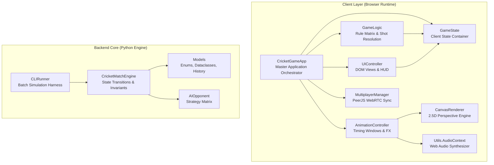
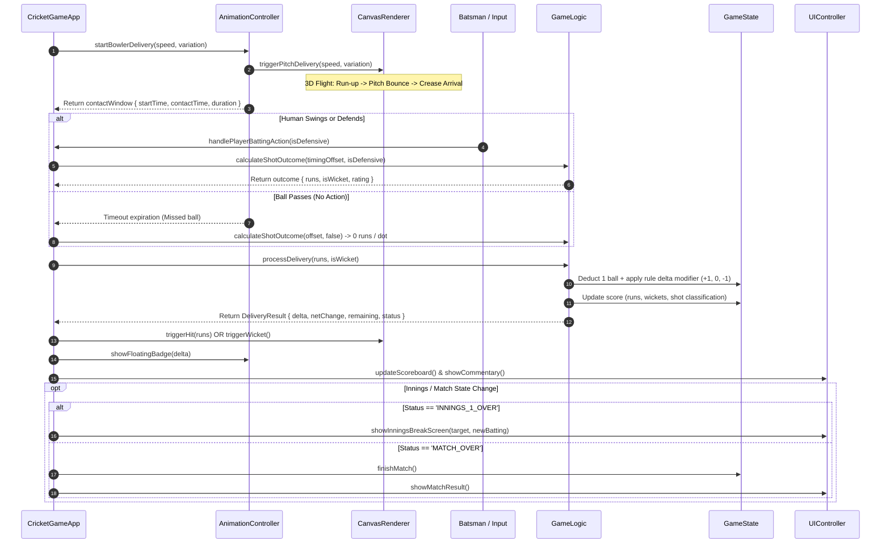
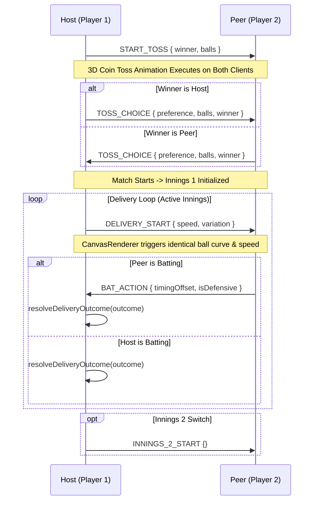

# 🏛️ System Architecture Specification

This document provides a comprehensive technical breakdown of the architecture, subsystem design, 2.5D rendering pipeline, procedural physics, and multiplayer synchronization protocols for the **Even/Odd Cricket Game**.

---

## 1. High-Level Subsystem Architecture

The project employs a synchronized dual-engine architecture:
- **Client Presentation & Interaction Engine (JavaScript ES6+ & HTML5 Canvas):** Responsible for 60 FPS 2.5D rendering, procedural character animations, responsive DOM layout, spatial audio synthesis, and WebRTC P2P networking.
- **Authoritative Rule & Simulation Engine (Python 3.10+):** Enforces state validation, headless simulations, and strict adherence to the Even/Odd accounting rules.

---

## 2. Ball Lifecycle & Delivery Sequence

The delivery lifecycle manages asynchronous bowler run-up, 3D projectile flight, batsman decision timing, outcome evaluation, and bank accounting.

---

## 3. 2.5D Canvas Rendering & Procedural Physics

The rendering engine in [`js/canvas-renderer.js`](js/canvas-renderer.js) uses a 2.5D perspective vanishing projection model:

### A. Coordinate Transformation
- **Vertical Ratio:** $Y_{\text{progress}} = \frac{Y - Y_{\text{top}}}{Y_{\text{bottom}} - Y_{\text{top}}}$
- **Perspective Scale:** $\text{Scale}(Y) = 0.55 + 0.55 \times Y_{\text{progress}}$
- **3D Altitude Projection:** $Y_{\text{projected}} = Y - Z_{\text{altitude}}$

### B. Lateral Curve & Seam/Spin Formulas
1. **In-Swinger:**
   $$\text{Offset}(p) = \begin{cases} \sin\left(\frac{p}{p_{\text{bounce}}} \pi\right) \times 10 & p < p_{\text{bounce}} \\ 10 - \left(\frac{p - p_{\text{bounce}}}{1 - p_{\text{bounce}}}\right) \times 24 & p \ge p_{\text{bounce}} \end{cases}$$
2. **Out-Swinger:**
   $$\text{Offset}(p) = \begin{cases} -\sin\left(\frac{p}{p_{\text{bounce}}} \pi\right) \times 6 & p < p_{\text{bounce}} \\ -6 + \left(\frac{p - p_{\text{bounce}}}{1 - p_{\text{bounce}}}\right) \times 20 & p \ge p_{\text{bounce}} \end{cases}$$
3. **Googly Spin:**
   $$\text{Offset}(p) = \begin{cases} -\sin\left(\frac{p}{p_{\text{bounce}}} \pi\right) \times 12 & p < p_{\text{bounce}} \\ -12 + \left(\frac{p - p_{\text{bounce}}}{1 - p_{\text{bounce}}}\right) \times 26 & p \ge p_{\text{bounce}} \end{cases}$$

---

## 4. WebRTC Multiplayer Synchronization Protocol

The online mode uses PeerJS DataChannels for low-latency peer-to-peer state replication.

---

## 5. Security, Storage & Cache Integrity
- **Stateless Networking:** No server database or authentication tokens required.
- **Local Storage Isolation:** High scores and player aliases are scoped to `localStorage` with error-guarded fallbacks.
- **Service Worker & Cache Busters:** Every static asset link includes strict version query parameters (`?v=19.0`) with automatic cache-clearing listeners in `service-worker.js`.
