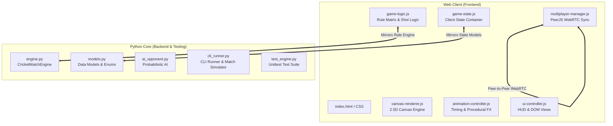

# 🏏 Even/Odd Cricket Game

> **An interactive, strategic cricket game in classic Doodle style, powered by a dual-engine architecture (HTML5 Canvas + Python Backend) with WebRTC multiplayer and an innovative Even/Odd Ball-Bank Economy.**

[](https://www.python.org/)
[](https://developer.mozilla.org/en-US/docs/Web/JavaScript)
[](https://peerjs.com/)
[](tests/test_engine.py)

---

## 📖 Table of Contents
- [Executive Overview](#-executive-overview)
- [Core Gameplay Mechanics](#-core-gameplay-mechanics)
- [Game Modes](#-game-modes)
- [Mascot Cast & Animated Characters](#-mascot-cast--animated-characters)
- [Bowling Variations & Physics Engine](#-bowling-variations--physics-engine)
- [Project Architecture](#-project-architecture)
- [Directory Structure](#-directory-structure)
- [Getting Started](#-getting-started)
- [Running Tests & Simulations](#-running-tests--simulations)
- [Documentation Index](#-documentation-index)

---

## 🌟 Executive Overview

**Even/Odd Cricket** reimagines arcade cricket by pairing timing-based strokeplay with tactical resource management. Rather than simply bashing boundaries on every delivery, players manage a dynamic **Ball Bank**:
- **Attacking on your preferred ball number (Even or Odd)** rewards you with runs and **adds bonus deliveries** back into your bank.
- **Defending on non-preferred balls** preserves your wicket with **0 penalty**.
- **Carelessly swinging or mistiming non-preferred balls** inflicts strict **ball bank penalties**.

The game features high-DPI 2.5D perspective pitch rendering, smooth procedural animations for the batsman, bowler, fielders, and crowd, multi-device touch responsiveness, and zero-configuration P2P online multiplayer.

---

## ⚖️ Core Gameplay Mechanics

### 1. The Coin Toss & Strategy Selection
- At match start, a 3D coin toss determines the first batting team.
- The toss winner bats first and chooses their **Preferred Ball Type**:
  - 🟡 **EVEN BALLS** (Deliveries #2, #4, #6, #8...)
  - 🔵 **ODD BALLS** (Deliveries #1, #3, #5, #7...)
- The opposing team automatically receives the reciprocal ball preference for their innings.

### 2. The Even/Odd Ball Bank Rule Matrix

Every delivery costs **1 ball** from the current match ball bank (`-1`). The rule matrix calculates the resulting `delta` modifier:

| Delivery Situation | Shot Outcome | Ball Pool Modifier (`delta`) | Net Ball Change (`-1 + delta`) | Visual & Audio Feedback |
| :--- | :--- | :--- | :--- | :--- |
| **Preferred Ball** *(Ball # matches choice)* | **Hit for Runs (>0)** | **`+1 Bonus`** | **`0`** (Replaces ball bowled) | 🌟 *Bonus chime + "+1 BONUS BALL!"* |
| **Preferred Ball** *(Ball # matches choice)* | **Dot Ball (0 runs)** | **`-1 Penalty`** | **`-2`** (Lost delivery + penalty) | ⚠️ *Penalty tone + "DOT (-1)"* |
| **Preferred Ball** *(Ball # matches choice)* | **Wicket (OUT)** | **`-1 Penalty`** | **`-2`** (Lost delivery + penalty) | 💥 *Wicket crash + "-1 PENALTY"* |
| **Non-Preferred Ball** *(Ball # does not match)* | **Defended / Dot (0 runs)** | **`0 Safe`** | **`-1`** (Standard ball cost) | 🛡️ *Wood click + "SAFE (0 PENALTY)"* |
| **Non-Preferred Ball** *(Ball # does not match)* | **Hit for Runs (>0)** | **`-1 Penalty`** | **`-2`** (Penalty for hitting non-preferred) | ⚠️ *Penalty tone + "HIT (-1)"* |
| **Non-Preferred Ball** *(Ball # does not match)* | **Wicket (OUT)** | **`-1 Penalty`** | **`-2`** (Lost delivery + penalty) | 💥 *Wicket crash + "-1 PENALTY"* |

### 3. The 3-Strike Wicket Penalty Rule 💥
- **The Violation:** Scoring runs ($>0$) on non-preferred deliveries **3 consecutive times** without defending triggers an immediate **$+1$ WICKET PENALTY**.
- **The Reset:** Playing a safe dot ball (or pressing **`D`** to block) successfully resets the risky streak back to **0**.
- **HUD Live Alert:** The in-game HUD displays warning badges (`⚠️ RISKY STREAK: 1/3`, `🚨 DANGER: 2/3! NEXT = WICKET!`).

---

## 🎚️ Difficulty Levels & Parameter Calibration

Players can customize their single-player challenge using the **Difficulty Slider** on the Main Menu and Settings Screen:

| Gameplay Parameter | 🟢 Low (Easy) | 🟡 Medium (Normal) | 🔴 High (Pro) |
| :--- | :--- | :--- | :--- |
| **Delivery Flight Duration** | ~1310ms (Slower, gentle float) | 1050ms (Standard authentic pace) | ~820ms (Express pace, rapid skid) |
| **Sweet Spot Window (4s & 6s)** | $\pm 130\text{ ms}$ (Forgiving) | $\pm 95\text{ ms}$ (Standard) | $\pm 65\text{ ms}$ (Razor-sharp precision) |
| **Single / Double Window** | $\pm 240\text{ ms}$ | $\pm 195\text{ ms}$ | $\pm 140\text{ ms}$ |
| **Mistimed Shot Wicket Risk** | 10% | 25% | 45% (Punishing edges/catches) |
| **Clean Bowled on Miss** | 10% | 20% | 35% |
| **AI Preferred Ball Attack** | ~50% Boundaries, 22% Out | ~65% Boundaries, 12% Out | ~80% Boundaries, 5% Out |
| **AI Non-Preferred Defense** | 55% Safe Dots (45% Errors) | 80% Safe Dots | **92% Safe Dots** (Near-flawless discipline) |

---

## 🎮 Game Modes

1. **👤 Single Player (vs AI):**
   - Challenge an intelligent AI opponent with 3 difficulty presets and Even/Odd strategy awareness.
   - Tracks all-time personal high scores stored in `localStorage`.
2. **👥 Local 2-Player (Pass & Play):**
   - Play locally with custom Player 1 and Player 2 names.
   - Automatic role switching between innings with full scorecard breakdown.
3. **🌐 Online Rooms (PeerJS WebRTC):**
   - Zero-server, low-latency peer-to-peer multiplayer using 5-letter Room Codes.
   - Host generates code; opponent enters code to connect.
   - Synchronizes coin toss, ball delivery parameters, bat timing, and innings transitions in real time.

---

## 🦁 Mascot Cast & Animated Characters

The game features an expressive, animated cast with dynamic role-based physics:

| Role | Mascot | Visual Identity & Persona | Animations & Actions |
| :--- | :--- | :--- | :--- |
| 🦁 **Batsman** | **Leo the Lion King** | Golden lion mane, helmet with wire grille visor, twin knee pads, English willow bat with grip rings, swishing tail | • Lofted Six pull shot overhead<br>• Four cover drive along turf<br>• Forward defensive block<br>• Running sprint between creases<br>• Roar celebrations & dismay expressions |
| 🐆 / 🦊 / 🦗 **Bowler** | **Dynamic Bowler System** | • **🐆 Cheetah:** Fast/Bouncer/Yorker pace<br>• **🦊 Sly Fox:** Spin/Googly/Slower flight<br>• **🦗 Mantis:** Inswing/Outswing seam | • Progressive 3-stride run-up with knee lifts<br>• 360° windmill delivery with wrist snap<br>• Celebratory leap & fist pump on wickets<br>• Frustration facepalm on boundaries |
| 🐌 **Fielders** | **Snail Outfield Crew** | Colorful swirly shell with gloss highlights, cute smiling face, team bandana, ball-tracking eyestalks | • Real-time ball tracking with dynamic eyestalk angles<br>• Sliding glides and spinning shell dives across turf<br>• Cheering bounce & antenna wiggles on wickets |
| 🐒 **Wicketkeeper** | **Milo the Monkey** | Athletic monkey crouched behind stumps with oversized webbed keeper gloves & curled tail | • Crouched keeping stance & tail swish<br>• Quick glove catch on missed deliveries |
| 🦒 **Match Umpire** | **Professor Giraffe** | Tall spotted neck, wide-brim sun-hat, round spectacles, navy blazer & bowtie | • **Six:** Reaches long neck & raises both arms high<br>• **Four:** Sweeping horizontal arm wave<br>• **Out:** Raises index hoof with sharp neck nod<br>• **Safe:** Horizontal arms spread wide |

---

## 🌪️ Bowling Variations & Physics Engine

The bowler delivers 7 distinct procedural delivery variations with unique 3D trajectory arcs, lateral seam/spin curves, and visual auras:

| Delivery Variation | Pace / Duration | Trajectory & Physics Behavior | Visual Aura / Glow | Strategic Counter |
| :--- | :--- | :--- | :--- | :--- |
| ⚡ **Good Length Seamer** | Medium/Fast (880–1050ms) | True bounce at 50% pitch length, classic seam alignment. | Red leather shine | Baseline rhythm timing for regular strokes. |
| 🌪️ **Rising Bouncer** | Fast (820ms) | Pitches short (35% down pitch), climbs steeply (28px altitude) to helmet height. | 🔥 Orange Aura + Sparks | Early swing timing or duck/forward defense **[D]**. |
| 💨 **Express Yorker** | Blazing (760ms) | Pitches full (78% down pitch), skids low along the turf (7px altitude). | 💥 Supersonic Red Glow | Late timing precision or solid block **[D]**. |
| 🐢 **Knuckle Slower Ball** | Slow (1350ms) | Floats in the air with extended flight time. | ❄️ Cyan Mist Aura | Wait patiently; avoid swinging too early. |
| 🌀 **Sharp In-Swinger** | Fast (880–1000ms) | Drifts away outside off-stump then darts back sharply into the batsman. | ⚡ Electric Blue Wind | Tight sweet spot; avoid getting bowled through gate. |
| 💫 **Sneaky Out-Swinger** | Medium (900–1020ms) | Curves away towards off-side away from batsman's body. | 🍃 Emerald Green Trail | Teases outside edges on aggressive cross-bat shots. |
| 🔮 **Tricky Googly** | Medium (1150ms) | Drifts left in flight, then breaks sharply right off the pitch. | 🔮 Mystical Purple Swirl | Disrupted lateral timing; rewarding when read right. |

---

## 🏗️ Project Architecture



For in-depth architectural details, sequence diagrams, and lifecycle specifications, see [`ARCHITECTURE.md`](ARCHITECTURE.md).

---

## 📂 Directory Structure

```
CricketGame/
├── .agents/                    # Multi-agent directives and guidance
│   └── AGENTS.md               # Central AI Agent registry
├── assets/                     # App icons and graphics
├── cricket_backend/            # Python backend match engine
│   ├── __init__.py             # Module exports
│   ├── ai_opponent.py          # AI batting strategy algorithms (Difficulty scaled)
│   ├── cli_runner.py           # Interactive CLI & match simulator
│   ├── engine.py               # Core CricketMatchEngine & 3-Strike Penalty
│   └── models.py               # Dataclasses, enums, state models
├── css/                        # Responsive stylesheet modules
│   ├── animations.css          # CSS keyframe effects
│   ├── cricket-field.css       # Pitch styling tokens
│   ├── main.css                # Primary UI theme, difficulty slider & HUD styles
│   ├── responsive.css          # Mobile media queries (≤600px)
│   └── stick-figures.css       # SVG & actor presentation styles
├── js/                         # Modular JavaScript client modules
│   ├── animation-controller.js # Animation coordinator
│   ├── app.js                  # Master application orchestrator
│   ├── canvas-renderer.js      # 2.5D Canvas rendering & physics engine
│   ├── game-logic.js           # Client rule evaluation, 3-strike rule & shot timing
│   ├── game-state.js           # Client state store & difficulty persistence
│   ├── multiplayer-manager.js  # PeerJS WebRTC P2P room networking
│   ├── ui-controller.js        # DOM screens, difficulty slider & HUD manager
│   └── utils.js                # Web Audio API & helper utilities
├── tests/                      # Automated test suite
│   └── test_engine.py          # Python unit tests for rule engine
├── index.html                  # Main application entry point & in-game tutorial
├── manifest.json               # Web app manifest
├── service-worker.js           # Cache handling & PWA worker
├── AGENT.md                    # Primary developer & AI directives
├── TESTING_AGENT.md            # Quality gates & test audit protocols
├── DOCUMENTATION_AGENT.md      # Documentation Agent operating directives
├── ARCHITECTURE.md             # System architecture & protocol documentation
├── API_REFERENCE.md            # Complete API & module documentation
└── TESTING_GUIDE.md            # Test execution reference
```

---

## 🚀 Getting Started

### Prerequisites
- **Web Browser:** Modern desktop or mobile browser (Chrome, Safari, Edge, Firefox).
- **Python:** Python 3.10+ (for backend engine, test suite, and local server).

### 1. Launch Web Application
Start a local HTTP server from the project root:
```bash
python -m http.server 8080
```
Open **`http://localhost:8080`** in your browser.

### 2. Run Interactive CLI Match
Play the terminal-based engine directly:
```bash
python cricket_backend/cli_runner.py
```

---

## 🧪 Running Tests & Simulations

### Unit Test Suite
Execute the complete Python unit test suite:
```bash
python -m unittest discover tests -v
```

### Automated CLI Match Simulation
Run batch headless match simulations to verify rule accuracy:
```bash
python cricket_backend/cli_runner.py --sim 10
```

---

## 📚 Documentation Index
- [System Architecture & Physics Engine (`ARCHITECTURE.md`)](ARCHITECTURE.md)
- [Complete API Reference & Data Contracts (`API_REFERENCE.md`)](API_REFERENCE.md)
- [Development Agent Directives (`AGENT.md`)](AGENT.md)
- [Testing Agent Quality Gates (`TESTING_AGENT.md`)](TESTING_AGENT.md)
- [Documentation Agent Directives (`DOCUMENTATION_AGENT.md`)](DOCUMENTATION_AGENT.md)
- [Testing Guide & Cheat Sheet (`TESTING_GUIDE.md`)](TESTING_GUIDE.md)

---

## 👨‍💻 Created by Ashay Sherekar

Developed with ❤️ by **Ashay Sherekar**.

- **LinkedIn:** [linkedin.com/in/ashay-sherekar](https://www.linkedin.com/in/ashay-sherekar)
- **Instagram:** [@ashay_sherekar](https://www.instagram.com/ashay_sherekar/)
- **GitHub:** [@ASHAYSHEREKAR](https://github.com/ASHAYSHEREKAR)
- **Email:** [ashaysherekar12@gmail.com](mailto:ashaysherekar12@gmail.com)


